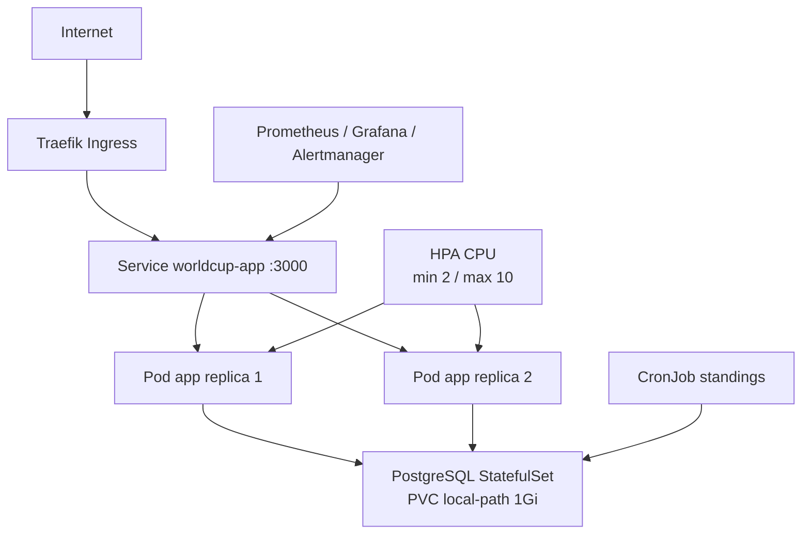

# Livrable final - Capstone DPLC World Cup 2026

## Acces public

Application :

```text
http://178.170.25.235
```

Verification rapide :

```bash
curl -sf http://178.170.25.235/api/health
curl -sf http://178.170.25.235/api/health/db
curl -sf http://178.170.25.235/metrics | head
```

## Architecture livree

Choix retenu : Kubernetes k3s sur VPS Ikoula.



Fichiers principaux :

- `k8s/helm/worldcup-app/` : chart Helm complet.
- `docs/DEPLOY_VPS.md` : runbook de deploiement.
- `docs/OPTIMISATION.md` : justification Dockerfile.
- `docs/MISSION_3_JOB.md` : design du job.
- `docs/LOAD_TESTS.md` : tests de charge live.
- `docs/CI_CD.md` : pipeline CI/CD.
- `.github/workflows/ci-cd.yml` : workflow GitHub Actions.

## Mission 1 - Dockerfile optimise

Livrables :

- `app/Dockerfile`
- `app/.dockerignore`
- `docs/OPTIMISATION.md`

Ce qui a ete corrige :

- image `node:20-alpine` au lieu de `latest` ;
- installation reproductible via `npm ci` ;
- cache Docker optimise avec copie de `package*.json` avant le code ;
- suppression des devDependencies en runtime ;
- execution avec un utilisateur non-root ;
- `.dockerignore` pour eviter d'embarquer `.git`, `node_modules`, secrets et fichiers inutiles.

Validation :

```bash
docker build -t worldcup-app:optimized ./app
docker run --rm worldcup-app:optimized whoami
```

## Mission 2 - Deploiement cloud Kubernetes

Livrables :

- chart Helm : `k8s/helm/worldcup-app/`
- runbook : `docs/DEPLOY_VPS.md`

Commandes de verification :

```bash
kubectl get all -n worldcup
kubectl get ingress -n worldcup
kubectl get hpa -n worldcup
kubectl get pvc -n worldcup
```

Points couverts :

- application exposee sur internet via Traefik ;
- 2 replicas applicatifs minimum ;
- HPA configure de 2 a 10 replicas ;
- PostgreSQL en StatefulSet avec volume persistant ;
- probes de readiness/liveness ;
- monitoring Prometheus/Grafana/Alertmanager.

Limite honnete : le VPS est single-node. Donc on demontre de la resilience applicative et du self-healing Kubernetes, pas une vraie haute disponibilite multi-node ou multi-AZ. Si quelqu'un dit que c'est "HA cloud production", c'est faux.

## Mission 3 - Job Kubernetes

Livrables :

- `docs/MISSION_3_JOB.md`
- `k8s/helm/worldcup-app/files/refresh-standings.sql`
- `k8s/helm/worldcup-app/templates/standings-cronjob.yaml`
- `k8s/helm/worldcup-app/templates/standings-job-configmap.yaml`

Fonctionnement :

- CronJob `worldcup-app-standings` toutes les 15 minutes ;
- lecture des tables PostgreSQL `teams` et `matches` ;
- calcul du classement par groupe ;
- ecriture dans `group_standings_snapshots`.

Demo :

```bash
kubectl get cronjob -n worldcup
kubectl create job -n worldcup --from=cronjob/worldcup-app-standings standings-manual-$(date +%s)
kubectl logs -n worldcup -l app.kubernetes.io/component=standings-job --tail=80
kubectl exec -n worldcup postgres-0 -- psql -U worldcup -d worldcup2026 \
  -c "SELECT generated_at, group_letter, rank, team_name, points FROM group_standings_snapshots ORDER BY generated_at DESC, group_letter, rank LIMIT 24;"
```

## Tests de charge live

Livrables :

- `scripts/live-load-test.sh`
- `scripts/hpa-scale-test.sh`
- `docs/LOAD_TESTS.md`

Test HTTP mixte :

```bash
TARGET_URL=http://178.170.25.235 DURATION_SECONDS=60 CONCURRENCY=30 ./scripts/live-load-test.sh
```

Test CPU pour declencher le HPA :

```bash
TARGET_URL=http://178.170.25.235 DURATION_SECONDS=180 CONCURRENCY=40 ./scripts/hpa-scale-test.sh
```

Commandes utiles pendant la demo :

```bash
kubectl get hpa -n worldcup -w
kubectl get pods -n worldcup -l app.kubernetes.io/name=worldcup-app -w
kubectl top pods -n worldcup
```

## Resilience et self-healing

Crash volontaire de l'app :

```bash
curl -X POST http://178.170.25.235/api/admin/kill
kubectl get pods -n worldcup -w
curl -sf http://178.170.25.235/api/health/db
```

Suppression d'un pod :

```bash
POD=$(kubectl get pods -n worldcup -l app.kubernetes.io/name=worldcup-app -o name | head -1)
kubectl delete "$POD" -n worldcup
kubectl get pods -n worldcup -w
```

Ce qu'il faut montrer : Kubernetes recree un pod et le service continue de router vers les replicas disponibles.

## Observabilite

Stack livree :

- Prometheus ;
- Grafana ;
- Alertmanager ;
- ServiceMonitor pour `/metrics` ;
- PrometheusRule pour alertes applicatives.

Acces Grafana :

```bash
kubectl port-forward -n monitoring svc/prometheus-grafana 3001:80 --address 0.0.0.0
```

URL :

```text
http://178.170.25.235:3001
```

Identifiants du runbook :

```text
admin / admin123
```

PromQL utiles :

```promql
rate(http_requests_total[5m])
histogram_quantile(0.95, rate(http_request_duration_seconds_bucket[5m]))
kube_pod_status_phase{namespace="worldcup", phase="Running"}
```

## CI/CD

Livrables :

- `.github/workflows/ci-cd.yml`
- `docs/CI_CD.md`
- `scripts/vps-diagnostic.sh`

Fonctionnement :

- sur pull request vers `main` : tests Node.js ;
- sur push vers `main` : tests, envoi des sources sur le VPS, build Docker sur le VPS, push Docker Hub, `helm upgrade` ;
- deploiement via l'environnement GitHub `prod` ;
- secrets requis : `SSH_HOST`, `SSH_USER`, `SSH_PASSWORD` ;
- Docker Hub est utilise depuis la session deja configuree de l'utilisateur `claude` sur la VM.

## FinOps

Estimation :

| Solution | Cout mensuel estime |
| --- | ---: |
| VPS Ikoula YNOV | 0 EUR/mois |
| VPS equivalent type Hetzner | environ 6 EUR/mois |
| GKE Autopilot + Cloud SQL | environ 70 USD/mois |
| AWS EKS + RDS + ALB | environ 120 USD/mois |

Trade-off :

- tres bon cout pour un capstone ;
- complexite d'exploitation plus elevee qu'un cloud manage ;
- sauvegardes, patchs systeme et upgrades k3s a gerer soi-meme ;
- pas de tolerance a la panne du noeud VPS.

## Ordre conseille pour la soutenance

1. Montrer ce fichier et l'architecture.
2. Ouvrir `http://178.170.25.235`.
3. Montrer `kubectl get all -n worldcup`.
4. Lancer `scripts/live-load-test.sh`.
5. Lancer `scripts/hpa-scale-test.sh`.
6. Faire un crash test avec `/api/admin/kill`.
7. Montrer Grafana/Prometheus.
8. Declencher le CronJob mission 3.
9. Montrer la pipeline GitHub Actions.
