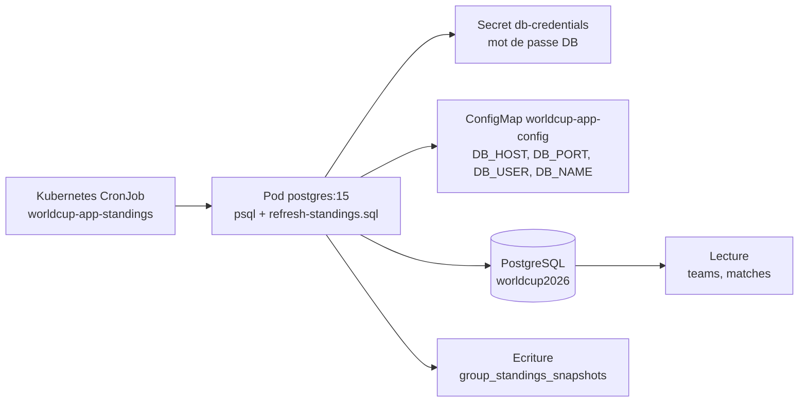

# Mission 3 - Job Kubernetes de classement automatique

## Objectif

Le job calcule automatiquement le classement des groupes de la Coupe du Monde 2026 a partir des matchs stockes dans PostgreSQL.

Il lit les tables applicatives `teams` et `matches`, applique les regles classiques de classement d'un groupe, puis ecrit un snapshot dans `group_standings_snapshots`.

Le choix est volontairement simple et defensable : l'application expose deja un calcul de classement a la volee via `/api/standings`, mais ce job materialise le resultat en base pour historiser les classements et eviter de recalculer a chaque lecture analytique.

## Architecture



## Fonctionnement

- Technologie : `CronJob` Kubernetes dans le namespace `worldcup`.
- Image : `postgres:15`, reutilisee uniquement pour avoir le client `psql`.
- Frequence : toutes les 15 minutes pour faciliter la demo en soutenance.
- Concurrence : `Forbid`, donc deux executions ne peuvent pas se marcher dessus.
- Secrets : le mot de passe PostgreSQL reste dans `db-credentials`, pas dans Git.
- Ressources : job limite a `100m` CPU et `128Mi` RAM, car le traitement est court.

## Donnees produites

Table creee automatiquement si elle n'existe pas :

```sql
group_standings_snapshots(
  snapshot_id,
  generated_at,
  group_letter,
  rank,
  team_id,
  team_name,
  played,
  won,
  drawn,
  lost,
  goals_for,
  goals_against,
  goal_difference,
  points
)
```

Chaque execution insere 48 lignes, une par equipe. Le champ `generated_at` permet de retrouver un classement precis dans le temps.

## Commandes de demonstration

Verifier l'existence du CronJob :

```bash
kubectl get cronjob -n worldcup
```

Declencher une execution manuelle :

```bash
kubectl create job -n worldcup --from=cronjob/worldcup-app-standings standings-manual-$(date +%s)
```

Voir les logs :

```bash
kubectl logs -n worldcup -l app.kubernetes.io/component=standings-job --tail=80
```

Verifier les snapshots en base :

```bash
kubectl exec -n worldcup postgres-0 -- psql -U worldcup -d worldcup2026 \
  -c "SELECT generated_at, group_letter, rank, team_name, points, goal_difference FROM group_standings_snapshots ORDER BY generated_at DESC, group_letter, rank LIMIT 24;"
```

## Pourquoi ce job est pertinent

- Il lit vraiment la BDD applicative, donc ce n'est pas un job decoratif.
- Il produit une donnee exploitable pour un dashboard, un export ou un rapport.
- Il est reproductible dans Helm, donc compatible avec l'approche Kubernetes choisie.
- Il reste peu couteux et peu risque : pas de modification des routes API imposees par l'evaluation.
